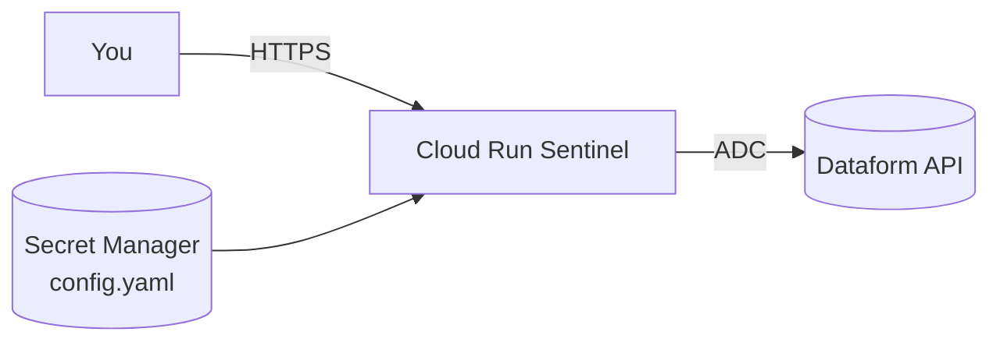

# Dataform Sentinel

> Stateless, live-only monitoring UI for Google Cloud Dataform pipelines.

Dataform Sentinel is a small Next.js app you self-host on Cloud Run. It hits the Dataform API directly — no database, no scheduler, no persistence — so what you see is always the live state of your pipelines. Configure it with one YAML file, deploy it with Terraform, and onboard a whole team in minutes.

<!-- Screenshot placeholder. Drop your deployed screenshot here. -->


## Features

**Monitoring**

- Global KPIs across every repo: runs/24h, success rate, active runs, failed assertions
- Per-repo dashboard with runs timeline, success trend vs SLO, duration distribution, top failing actions
- GitHub-Actions-style mini bar chart + duration sparkline per repo card
- Click-through invocation detail: DAG, list, assertions, compiled SQL

**Analytics**

- Assertions heatmap (top 20 in repo view, full list on the deep-dive page)
- Flakiness detection (alternation count) surfaced on the assertions page
- p50 / p95 duration markers on the distribution histogram

**Actions**

- Run workflow (fresh compilation from the default workspace or git branch)
- Cancel a running invocation
- Rerun all / rerun failed only / rerun a single action or assertion

**Ops**

- `/api/health` liveness endpoint, cheap (no Dataform API calls)
- `unstable_cache` 10s TTL on every server fetch to absorb bursts
- Client polling only when at least one invocation is RUNNING

## Architecture



Single container, no database, no queue. Credentials come from the Cloud Run service account (ADC).

---

## 🚀 Try it locally in 2 minutes

Zero GCP calls needed — `SENTINEL_MOCK=1` serves fixture data so you can explore every page offline.

```bash
git clone https://github.com/mchl-schrdng/dataform-sentinel.git
cd dataform-sentinel
pnpm install
SENTINEL_MOCK=1 pnpm dev
```

Then open <http://localhost:3000>.

Want to hit real Dataform projects instead?

```bash
cp config.yaml.example config.yaml
# edit config.yaml with your targets
gcloud auth application-default login
pnpm dev
```

Requirements: Node 20+, pnpm, gcloud CLI, ADC with `roles/dataform.editor` on each target project.

---

## ☁️ Deploy to your own GCP in 10 minutes

Uses the public GHCR image. Recommended for most self-hosters.

```bash
git clone https://github.com/mchl-schrdng/dataform-sentinel.git
cd dataform-sentinel
bash scripts/setup.sh
```

`setup.sh` is interactive:

1. Collects your GCP project, region, Dataform projects, and repository list
2. Enables the required APIs
3. Writes `config.yaml` and `terraform/terraform.tfvars`
4. Offers to run `terraform apply` immediately

You can also do it by hand:

```bash
cp config.yaml.example config.yaml
# edit config.yaml
cp terraform/terraform.tfvars.example terraform/terraform.tfvars
# edit terraform/terraform.tfvars
cd terraform
terraform init
terraform apply
```

---

## 🏢 Deploy internally with your own Artifact Registry

For teams that need supply-chain control — image is mirrored into your own GCP project.

```bash
git clone https://github.com/mchl-schrdng/dataform-sentinel.git
cd dataform-sentinel
bash scripts/setup.sh
# when prompted for image source, choose [2] Internal Artifact Registry
```

Under the hood this calls `scripts/publish-internal.sh` which:

- creates the AR repo if missing
- authenticates docker against `REGION-docker.pkg.dev`
- builds and pushes `REGION-docker.pkg.dev/PROJECT/REPO/dataform-sentinel:VERSION` (and `:latest`)

Then `terraform apply` uses the internal image reference in the generated tfvars.

---

## Accessing your private Cloud Run service

The default Terraform uses `INGRESS_TRAFFIC_INTERNAL_ONLY`. Three ways to reach it:

1. **gcloud proxy** (simplest, for personal use):
   ```bash
   gcloud run services proxy dataform-sentinel --region=REGION
   ```
2. **IAP tunnel + TCP forwarding** through a bastion if you have one
3. **IAP + Load Balancer** — ready-made module in `examples/with-iap/`

---

## Configuration reference

`config.yaml` is the single source of truth for what Sentinel monitors.

| Field | Type | Required | Description |
| --- | --- | --- | --- |
| `refresh_interval_seconds` | int | no (default `30`) | Polling cadence while runs are in progress (5–300) |
| `service_account` | string (email) | no | Optional. SA that Dataform pipelines execute as. Required when the project enforces strict IAM act-as. Overridden by `SENTINEL_SERVICE_ACCOUNT` env var. |
| `targets[].key` | string | **yes** | URL slug for the repo. `^[a-z0-9-]+$`, unique |
| `targets[].display_name` | string | **yes** | Human name shown in the UI |
| `targets[].project_id` | string | **yes** | GCP project that hosts the Dataform repository |
| `targets[].location` | string | **yes** | Dataform region, e.g. `europe-west1` |
| `targets[].repository` | string | **yes** | Dataform repository name |

Changes to `config.yaml` require a new Secret Manager version (Terraform detects this automatically via file hash) and a Cloud Run revision to pick up.

## Service account requirements

Sentinel uses **exactly one** service account for everything. That same SA is:

- Attached to the Cloud Run service, so ADC picks it up for authenticating to the Dataform API (list/get invocations, actions, assertions).
- Passed as the `serviceAccount` field on every `InvocationConfig`, so Dataform workflow invocations triggered from the Run / Rerun buttons execute as it.

Because the caller and the actor are the same identity, the SA must be able to impersonate *itself* — see `roles/iam.serviceAccountUser` below.

### Required roles

| Role | Where | Why |
| --- | --- | --- |
| `roles/dataform.editor` | every GCP project hosting a monitored Dataform repo | List invocations *and* create new ones. `roles/dataform.viewer` is not enough if you want Run / Rerun to work. |
| `roles/iam.serviceAccountUser` | on the SA itself (self-binding) | `createWorkflowInvocation` with `serviceAccount=X` triggers a strict act-as check; since caller == actor, the SA must be able to impersonate itself. |
| `roles/bigquery.jobUser` | every Dataform project | Lets the executed pipeline create BigQuery jobs. |
| `roles/bigquery.dataEditor` | every Dataform project (or scope to specific datasets) | Lets the executed pipeline read source tables and write target tables. |

### Bootstrap with gcloud

```bash
# 1. Create the SA
gcloud iam service-accounts create dataform-sentinel \
  --display-name="Dataform Sentinel" \
  --project=YOUR_HOST_PROJECT

SA="dataform-sentinel@YOUR_HOST_PROJECT.iam.gserviceaccount.com"

# 2. Grant Dataform + BigQuery on every Dataform project you monitor
for PROJECT in dataform-project-1 dataform-project-2; do
  for ROLE in roles/dataform.editor roles/bigquery.jobUser roles/bigquery.dataEditor; do
    gcloud projects add-iam-policy-binding "$PROJECT" \
      --member="serviceAccount:$SA" --role="$ROLE"
  done
done

# 3. Self-impersonation (needed for strict act-as)
gcloud iam service-accounts add-iam-policy-binding "$SA" \
  --member="serviceAccount:$SA" --role="roles/iam.serviceAccountUser" \
  --project=YOUR_HOST_PROJECT
```

Wire the SA into Sentinel by setting `service_account` in `config.yaml` or `SENTINEL_SERVICE_ACCOUNT` (see the references above and below) and attach it to the Cloud Run service.

### The Dataform system agent

Enabling the Dataform API provisions a Google-managed service agent in each project:

```
service-<PROJECT_NUMBER>@gcp-sa-dataform.iam.gserviceaccount.com
```

This agent is separate from the Sentinel SA and does **not** need any of the roles above. It does, however, need its own BigQuery permissions if the project was set up without the default Dataform IAM grants. If you see errors like:

```
service-NNN@gcp-sa-dataform.iam.gserviceaccount.com does not have permission ...
```

grant the agent BigQuery access:

```bash
PROJECT_NUMBER=$(gcloud projects describe YOUR_DATAFORM_PROJECT --format='value(projectNumber)')
AGENT="service-${PROJECT_NUMBER}@gcp-sa-dataform.iam.gserviceaccount.com"

gcloud projects add-iam-policy-binding YOUR_DATAFORM_PROJECT \
  --member="serviceAccount:$AGENT" --role="roles/bigquery.dataEditor"
```

### Local development

For `pnpm dev` against real GCP (not `SENTINEL_MOCK=1`) you have two options:

- **User ADC.** `gcloud auth application-default login` with your own Google account. Reads work against any project where you have `roles/dataform.viewer`. Invocations you trigger run as *your user* unless you set `SENTINEL_SERVICE_ACCOUNT` — in which case your user needs `serviceAccountTokenCreator` on that SA.
- **Impersonate the Sentinel SA.** Closer to production behavior:
  ```bash
  gcloud auth application-default login \
    --impersonate-service-account="$SA"
  ```
  Requires your user to hold `roles/iam.serviceAccountTokenCreator` on the Sentinel SA.

### Terraform

The module in `terraform/` automates everything above. It creates the SA, grants `roles/dataform.editor`, `roles/bigquery.jobUser`, and `roles/bigquery.dataEditor` on every entry in `var.dataform_projects`, adds the self-impersonation binding, and gives each project's Dataform service agent `roles/iam.serviceAccountTokenCreator` on the SA (without this every invocation fails; see the system-agent section above). You don't need to run the gcloud snippet above if you're using Terraform.

## Environment variables reference

| Var | Default | Description |
| --- | --- | --- |
| `SENTINEL_CONFIG_PATH` | `/etc/sentinel/config.yaml` (prod) / `./config.yaml` (dev) | Override the config path |
| `SENTINEL_MOCK` | unset | `1` → serve fixture data, skip GCP. Dev-only. |
| `SENTINEL_SERVICE_ACCOUNT` | unset | SA email that Dataform pipelines execute as. Required when the project enforces strict IAM act-as. Overrides `service_account` in `config.yaml`. In prod, wire via Secret Manager → env var. |
| `LOG_LEVEL` | `info` | pino level: `trace`, `debug`, `info`, `warn`, `error`, `fatal` |
| `NODE_ENV` | inherited | Next.js env mode |
| `PORT` | `3000` | HTTP listen port |

## Using a prebuilt image

```bash
docker pull ghcr.io/mchl-schrdng/dataform-sentinel:latest
docker run --rm -p 3000:3000 \
  -v $(pwd)/config.yaml:/etc/sentinel/config.yaml:ro \
  -v ~/.config/gcloud:/root/.config/gcloud:ro \
  -e GOOGLE_APPLICATION_CREDENTIALS=/root/.config/gcloud/application_default_credentials.json \
  ghcr.io/mchl-schrdng/dataform-sentinel:latest
```

## Updating

New releases are tagged `vX.Y.Z` and published to GHCR via GitHub Actions. To upgrade:

- **Public GHCR**: change `image_version` in `terraform.tfvars` and `terraform apply`.
- **Internal AR**: bump `image_version`, rerun `scripts/publish-internal.sh`, then `terraform apply`.

See the release notes in the GitHub Releases tab.

## Contributing

PRs welcome — see [CONTRIBUTING.md](./CONTRIBUTING.md).

## License

[MIT](./LICENSE)
