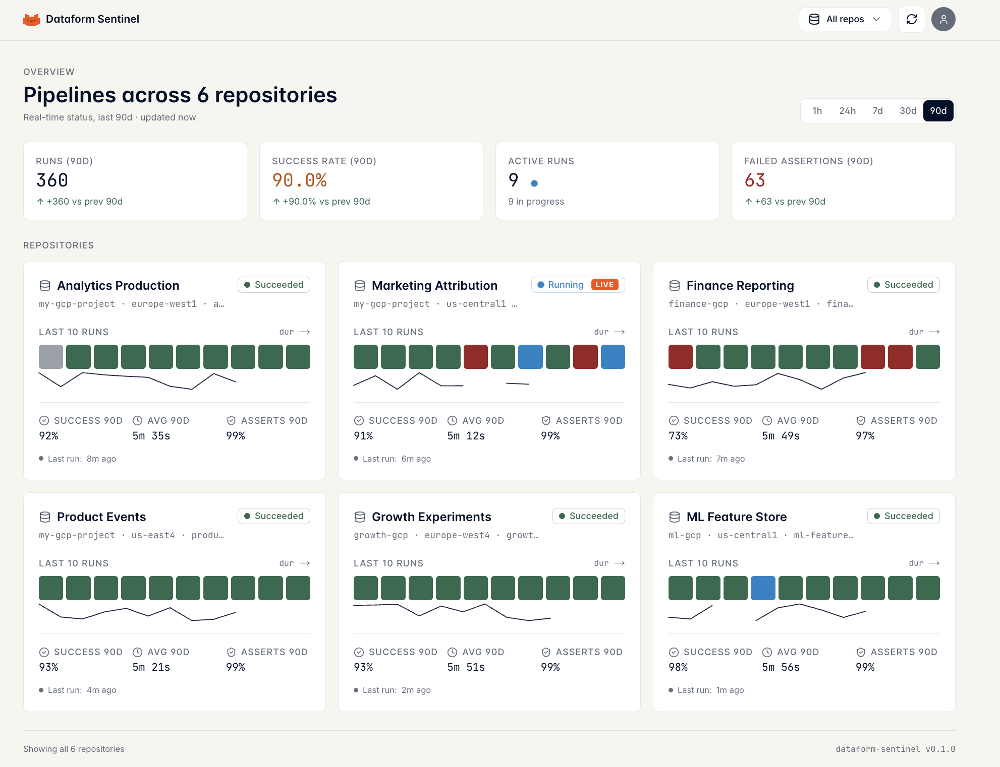
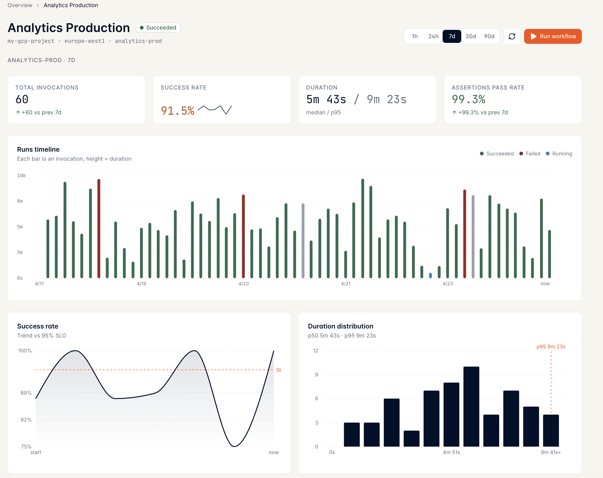
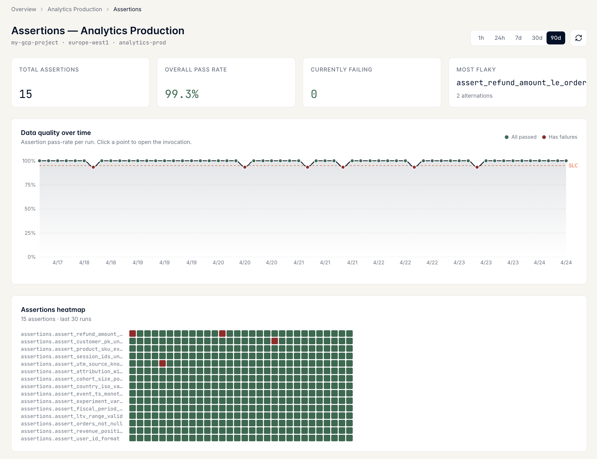
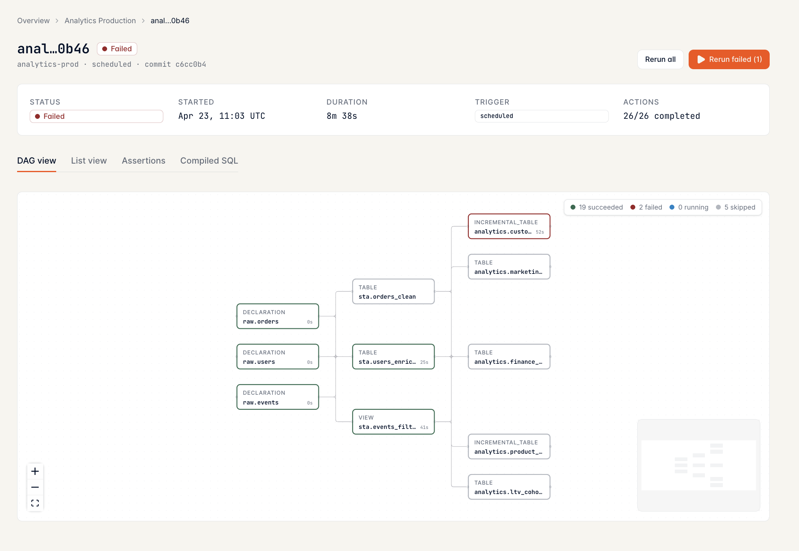

<h1>
  
  Dataform Sentinel
</h1>

> Stateless, live-only monitoring UI for Google Cloud Dataform pipelines.

A small Next.js app you run locally, pointed at your own Dataform repositories. No database, no scheduler, no persistence — every page hits the Dataform API directly so what you see is always the live state of your pipelines.

> **Requires Google Cloud Dataform with BigQuery.** Sentinel talks to the Dataform API (`dataform.googleapis.com`), which is the managed GCP service that runs your pipelines on BigQuery. If you're using standalone Dataform Core against Snowflake / Redshift / other warehouses, this tool won't work — it's specifically for users of Google Cloud Dataform on BigQuery.

> **Try it in 10 seconds, no GCP needed:** `git clone … && pnpm install && SENTINEL_MOCK=1 pnpm dev` — see below for details.



## Features

- **Overview** — KPIs across every repo, per-repo cards with status bars and duration sparklines
- **Per-repo dashboard** — runs timeline, success trend vs SLO, duration histogram, top failing actions, assertions heatmap, invocations table
  
- **Assertions deep-dive** — data-quality timeline, heatmap, sortable table with per-assertion drill-in
  
- **Invocation detail** — DAG, list, assertions, compiled SQL
  
- **Actions** — Run workflow, Cancel, Rerun all / failed only / single assertion
- **Mock mode** — browse every page without GCP credentials

---

## Quick start — mock data, no GCP

```bash
git clone https://github.com/mchl-schrdng/dataform-sentinel.git
cd dataform-sentinel
pnpm install
SENTINEL_MOCK=1 pnpm dev
```

Open <http://localhost:3000>. Six fake repos, seeded deterministically. Click everything.

---

## Real Dataform — two auth paths

Sentinel talks to the Dataform API via Google's Application Default Credentials (ADC) on your machine. Which option you pick depends on **what access your admin has given you**.

> **Not "anonymous" access.** Whichever option you pick, your own GCP identity still needs an explicit IAM grant. Option B just moves the grant from the Dataform project to a shared service account — it doesn't remove the need for a grant.

**Which option am I?**

```
Do you have `roles/dataform.editor` on the Dataform project directly?
  ├─ YES              → Option A (use your own identity)
  └─ NO
      └─ Does an admin granted you `roles/iam.serviceAccountTokenCreator`
         on a shared service account that has dataform.editor?
          ├─ YES      → Option B (impersonate that SA)
          └─ NO       → Ask your admin for one of the two grants above.
                        Without either, Sentinel cannot talk to Dataform.
```

### Prerequisites (both options)

- Node 20+, pnpm, gcloud CLI

### Option A — your GCP account has Dataform access

Your user already holds `roles/dataform.editor` on the Dataform project(s).

```bash
# 1. List your repos
cp config.yaml.example config.yaml
# edit config.yaml: project_id, location, repository per target

# 2. Sign in as yourself
gcloud auth application-default login

# 3. Run
pnpm dev   # → http://localhost:3000
```

Sentinel calls the Dataform API as you. Reads work; Run/Rerun work if you can invoke the target service.

**If Run/Rerun fails** with an error about "strict act-as" or "Service account must be set":
- "Strict act-as" is a GCP project policy that forces every Dataform pipeline invocation to declare which service account it runs as. Sentinel has no default — you pass one via `service_account:` below.
- Someone (your admin or you) needs to configure a `service_account:` in `config.yaml` that you have `roles/iam.serviceAccountUser` on
- Or switch to Option B

### Option B — your admin gave you impersonation rights on a shared SA

Your admin has already created `dataform-sentinel@<project>.iam.gserviceaccount.com`, given it the right roles, and granted **you** `roles/iam.serviceAccountTokenCreator` on it. You might have zero other permissions on the project — that's fine.

```bash
SA=dataform-sentinel@your-project.iam.gserviceaccount.com

# 1. Sign in as yourself, but tell gcloud to issue tokens as the SA
gcloud auth application-default login --impersonate-service-account=$SA

# 2. List your repos and tell Sentinel pipelines should also run as the SA
cp config.yaml.example config.yaml
# edit config.yaml: targets, plus add `service_account: <SA email>` at the top

# 3. Run
pnpm dev   # → http://localhost:3000
```

What's actually happening: gcloud holds your user OAuth, but every API call Sentinel makes uses a short-lived token minted **as the SA** via `iam.serviceAccounts.generateAccessToken`. No key file is stored anywhere — if the `tokenCreator` grant is revoked, you lose access on the next token refresh.

**If your admin hasn't set up the SA yet**, share the next section with them.

### One-time admin setup (Option B)

Whoever owns the project runs this once to create the shared SA and grant users impersonation rights:

```bash
PROJECT=your-dataform-project
SA=dataform-sentinel
SA_EMAIL="${SA}@${PROJECT}.iam.gserviceaccount.com"

# 1. Create the SA
gcloud iam service-accounts create $SA --display-name="Dataform Sentinel" --project=$PROJECT

# 2. Grant what Dataform pipelines need
for ROLE in roles/dataform.editor roles/bigquery.jobUser roles/bigquery.dataEditor; do
  gcloud projects add-iam-policy-binding $PROJECT --member="serviceAccount:$SA_EMAIL" --role="$ROLE"
done

# 3. Self-impersonation (required for Run/Rerun under strict act-as)
gcloud iam service-accounts add-iam-policy-binding $SA_EMAIL \
  --member="serviceAccount:$SA_EMAIL" --role="roles/iam.serviceAccountUser" --project=$PROJECT

# 4. Dataform's system agent needs tokenCreator on our SA
PROJECT_NUM=$(gcloud projects describe $PROJECT --format='value(projectNumber)')
gcloud iam service-accounts add-iam-policy-binding $SA_EMAIL \
  --member="serviceAccount:service-${PROJECT_NUM}@gcp-sa-dataform.iam.gserviceaccount.com" \
  --role="roles/iam.serviceAccountTokenCreator" --project=$PROJECT

# 5. Per user/group who needs to use Sentinel — repeat for each
gcloud iam service-accounts add-iam-policy-binding $SA_EMAIL \
  --member="user:alice@company.com" \
  --role="roles/iam.serviceAccountTokenCreator" --project=$PROJECT
```

Steps 1–4 are one-time per project. Step 5 is repeated whenever someone new joins (and the inverse — removing a user — is a single `remove-iam-policy-binding` call).

Without step 4 specifically, every Run/Rerun fails with `service-<N>@gcp-sa-dataform does not have permission to generate tokens for <sa>`. This is the most common gotcha.

---

## `config.yaml` reference

| Field | Type | Required | Description |
| --- | --- | --- | --- |
| `refresh_interval_seconds` | int | no (default `30`) | Polling cadence while runs are in progress (5–300) |
| `service_account` | string (email) | no | SA that Dataform pipelines execute as. Required under strict act-as. Overridden by `SENTINEL_SERVICE_ACCOUNT` env var. |
| `targets[].key` | string | **yes** | URL slug, `^[a-z0-9-]+$`, unique |
| `targets[].display_name` | string | **yes** | Human name shown in the UI |
| `targets[].project_id` | string | **yes** | GCP project hosting the Dataform repo |
| `targets[].location` | string | **yes** | Dataform region, e.g. `europe-west1` |
| `targets[].repository` | string | **yes** | Dataform repository name |

## Environment variables

| Var | Default | Description |
| --- | --- | --- |
| `SENTINEL_CONFIG_PATH` | `./config.yaml` | Override the config path |
| `SENTINEL_MOCK` | unset | `1` → serve fixture data, skip GCP |
| `SENTINEL_SERVICE_ACCOUNT` | unset | SA email that Dataform pipelines execute as. Overrides `service_account` in config |
| `LOG_LEVEL` | `info` | pino level: `trace` / `debug` / `info` / `warn` / `error` / `fatal` |
| `PORT` | `3000` | HTTP listen port |

## Troubleshooting

- **`Error: Failed to read config at ./config.yaml`** — run in mock mode (`SENTINEL_MOCK=1 pnpm dev`) or create the file (`cp config.yaml.example config.yaml`).
- **`PERMISSION_DENIED` when listing invocations** — your identity lacks `roles/dataform.editor`. Grant it (see Option A) or switch to Option B.
- **`Run/Rerun` fails with "Service account must be set when strict act-as checks are enabled"** — add `service_account: <email>` to `config.yaml` (or `export SENTINEL_SERVICE_ACCOUNT=<email>`) and make sure your user has `serviceAccountUser` on that SA.
- **Pipeline runs but errors with `service-<N>@gcp-sa-dataform does not have permission to generate tokens`** — the Dataform-system-agent `tokenCreator` binding is missing (see the admin setup block, step 4).

## Contributing

See [CONTRIBUTING.md](./CONTRIBUTING.md).

## License

[MIT](./LICENSE)
